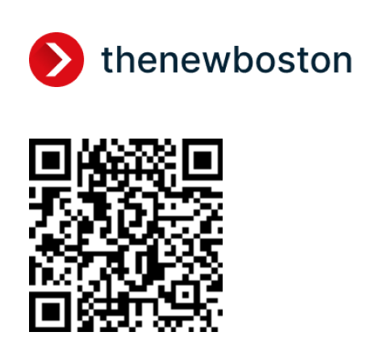
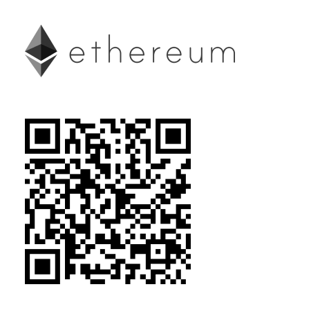

<p align="center">
  
</p>

> This repository contains the source code and documentation for [thenewboston.com](https://thenewboston.com/) website.

<p align="center">
  
</p>

[](https://thenewboston.com)  [](https://github.com/thenewboston-developers/website/issues) [](https://github.com/thenewboston-developers/Website/graphs/contributors) [](http://opensource.org/licenses/MIT)

## Table of Contents

- [Contributing](#contributing)
- [Getting Started](#getting-started)
- [Community](#community)
- [Donate](#donate)
- [License](#license)

## Contributing

Contributions are what make the open-source community such an amazing place to learn, inspire, and create. Any contributions you make are **greatly appreciated**.

To start with, you can always check the [open issues](https://github.com/thenewboston-developers/Website/issues) in this repository. You can filter these issues using the labels and find the ones that suit your domain.

All issues that have the **PR Reward** label are ready to be worked upon and specify the amount of coins to be transferred to the account of the person who solves that issue.

If you discover a new issue that is not yet reported, please open the same before working on it. People who discover bugs will be rewarded with the amount of coins specified by the **Bug Bounty Owed** labels.

Please avoid working on issues that have the **Not Ready** label on them.

The reward labels will be assigned to issues by the core team members based on certain parameters. If you want to create an issue with a design suggestion, please do it in the [design repository](https://github.com/thenewboston-developers/Design).

Every PR must be connected to an issue, so as stated above, before creating a PR, please raise an issue and reference it in the PR.

Before starting, add a comment to let others know that you'll be working on that issue.

It is strictly advised to **create a single PR per issue**. In any case, where two or more issues have the same root cause, you can club them in a single PR, otherwise, refrain from doing so.

Also, while working make sure you follow these guidelines:

- [React / JSX Style Guide](https://thenewboston.com/style-guide/react)
- [CSS / SASS Style Guide](https://thenewboston.com/style-guide/css)

Next steps:

1. Fork the project
2. Create your feature branch
3. Run `npm run lint` and make sure you have no errors
4. Commit your changes
5. Push to the branch
6. Open a pull request

For further help, you can check out the [FAQs](https://thenewboston.com/faq).

Finally, feel free to shoot any queries or suggestions. Don't hesitate. ;)

## Getting Started

After cloning the repo, run the following command to install the project dependencies:

```bash
npm install
```

Then to run the code, run the following command:

```bash
npm start
```

## Community

Join the community to stay updated on the most recent developments, project roadmaps, and random discussions about completely unrelated topics.

- [thenewboston.com](https://thenewboston.com/)
- [Discord](https://discord.gg/thenewboston)
- [Facebook](https://www.facebook.com/TheNewBoston-464114846956315/)
- [Instagram](https://www.instagram.com/thenewboston_official/)
- [LinkedIn](https://www.linkedin.com/company/thenewboston-developers/)
- [Reddit](https://www.reddit.com/r/thenewboston/)
- [Twitch](https://www.twitch.tv/thenewboston/videos)
- [Twitter](https://twitter.com/thenewboston_og)
- [YouTube](https://www.youtube.com/user/thenewboston)

## Donate

All donations will go to thenewboston to help fund the team to continue to develop the community and create new content.

| Coin                                                       | Address                                                          |
| ---------------------------------------------------------- | ---------------------------------------------------------------- |
|  | b6e21072b6ba2eae6f78bc3ade17f6a561fa4582d5494a5120617f2027d38797 |
|            | 3GZYi3w3BXQfyb868K2phHjrS4i8LooaHh                               |
|          | 0x0E38e2a838F0B20872E5Ff55c82c2EE7509e6d4A                       |

## License

thenewboston is [MIT licensed](http://opensource.org/licenses/MIT).
